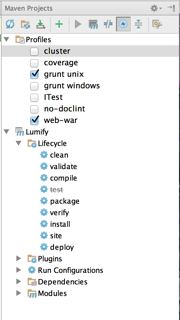
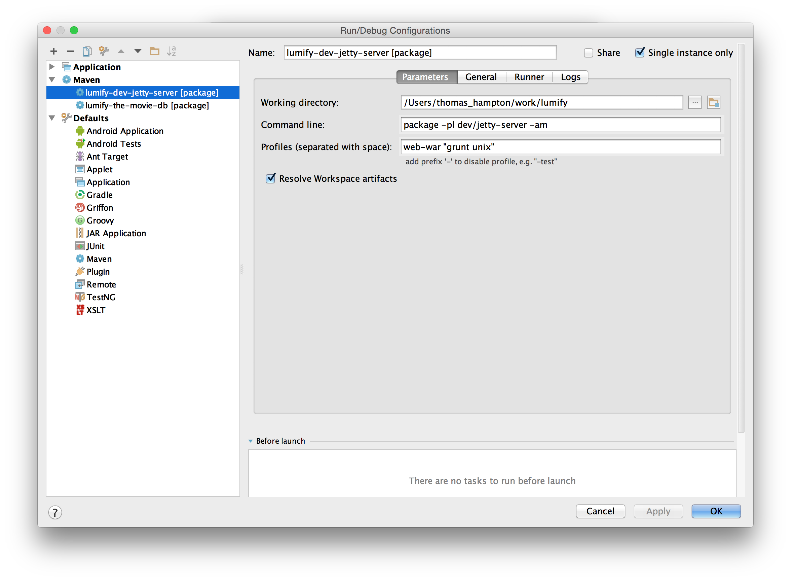
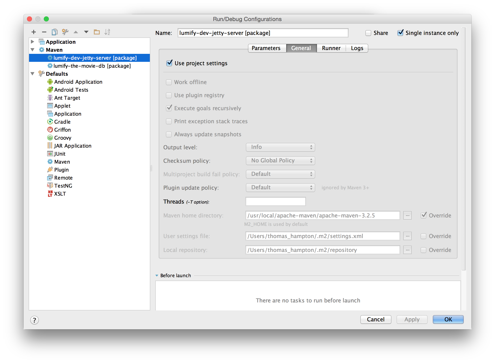
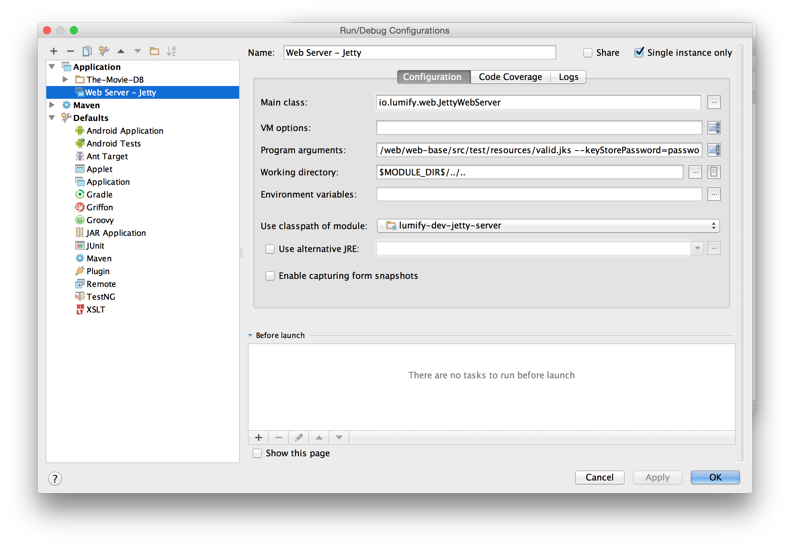

# Prereqs

* Setup [configuration](configuration.md) on your host machine.
* Install [dependencies](dependencies.md) on your host machine.

# IntelliJ

## Development Jetty Web Server
The Lumify project includes a Maven script that performs all the build steps required to build the Lumify Web App for
the Jetty Server. When using IntelliJ IDEA to build Lumify it is important to use the Maven integration to build Lumify
and not the "Make Project" function in IntelliJ.  The following instructions illustrate configuring IntelliJ IDEA
run/debug configurations for building & running the Lumify Jetty Server.

### Maven Projects Plugin pane
* Open the Maven Projects pane by selecting the "View -> Tool Windows -> Maven Projects" menu item
* In the Maven Projects pane select the cog icon, in the upper right corner, and select "Group Modules"
* Ensure that the "web-war" and "grunt unix" Maven Profiles are selected
* Ensure that the "Toggle 'Skip Tests' Mode" tool bar button is selected to disable executing unit tests (unless you want to run unit tests)

### Configure IntelliJ IDEA to build Lumify Jetty Web Server
* Create a Maven Run/Debug Configuration in IntelliJ IDEA with the following parameters

* Working directory - should be set to the location of your Lumify working directory
* Command line

        package - the maven goal to build
        -pl - identifies the maven project for the Lumify Jetty Server that should be built
        -am - causes all dependencies to be built as well.

* Profiles - List the Maven Profiles that should be used for the build.

* Configure the General tab as follows

### Configure IntelliJ IDEA to run Lumify Jetty Web Server
* Create a Application Run/Debug Configuration in IntelliJ IDEA with the following configuration.

* Module: `lumify-dev-jetty-server`
* Main class: `io.lumify.web.JettyWebServer`
* Program arguments:

        --webAppDir=$MODULE_DIR$/../../web/war/src/main/webapp
        --port=8888
        --httpsPort=8889
        --keyStorePath=$MODULE_DIR$/../../web/web-base/src/test/resources/valid.jks
        --keyStorePassword=password

* Working directory: `$MODULE_DIR$/../..`
* Use classpath of module: lumify-dev-jetty-server

